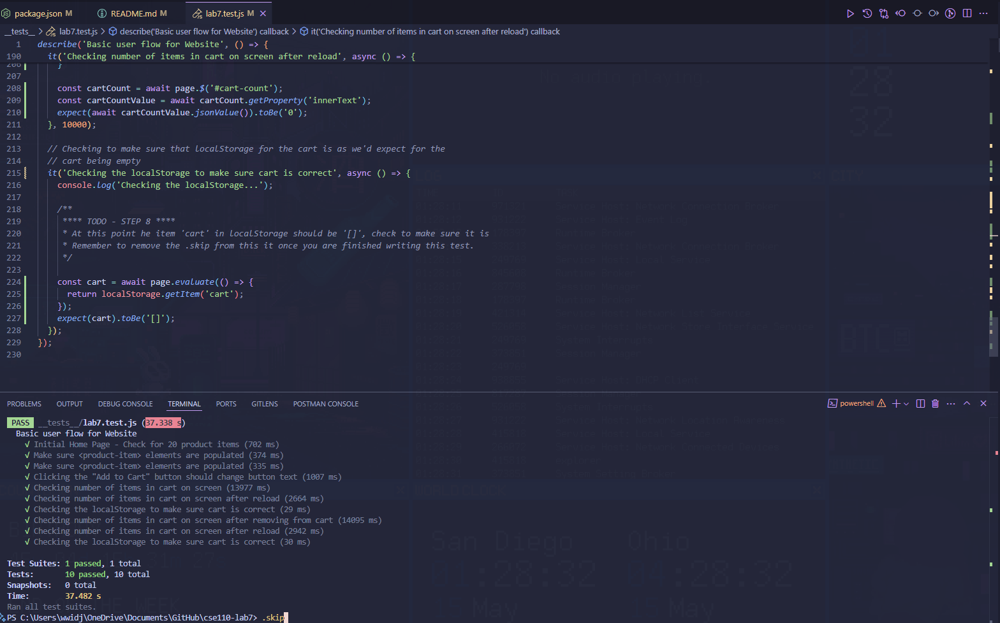

# Check Your Understanding

1) Where would you fit your automated tests in your Recipe project development pipeline? Select one of the following and explain why.

    > - Within a Github action that runs whenever code is pushed

    - Manually run them locally before pushing code
    - Run them all after all development is completed

    This would follow continuous integration, efficiency, help catch issues early on in development, and be scalable because we would not have to rely on developers running tests manually.

2) Would you use an end to end test to check if a function is returning the correct output? (yes/no)

    No

3) What is the difference between navigation and snapshot mode?

    The main difference between navigation and snapshot mode is that navigation mode is time-based and tells you the load times of components of your site and how to potentially improve these load times while snapshot mode takes a snapshot of the current state of the page and comes up with a few ratings for improving the website. Overall, both of these metrics try to target performance, accessibility, best practices and SEO.

4) Name three things we could do to improve the CSE 110 shop site based on the Lighthouse results.

    Three things we could do to improve the CSE 110 shop site based on the Lighthouse results are to properly size images, save images in better formats such as WebP and AVIF rather than PNG or JPEG for performance, and to compress some of our image files or down-size them for performance.

